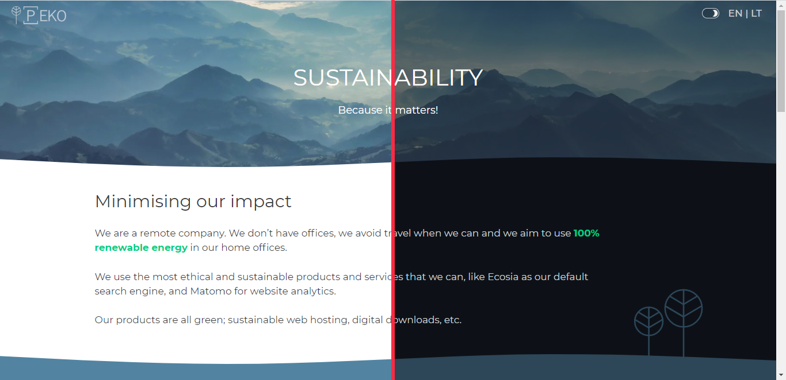
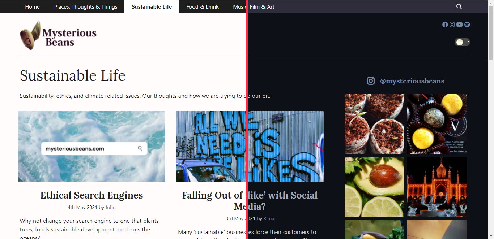

# WP Night Mode

  

A simple WP plugin for night mode. It doesn't do anything too fancy or complicated, instead it adds a new CSS class to body when night mode is selected. 

## How to use

1. You can download the zip file from this repo and then upload it to WordPres from the Add Plugins page.
2. Activate the plugin through the 'Plugins' menu in WordPress
3. Use `wp-night-mode` class on any element (for example Menu item) or `[wp-night-mode-button]` shortcode to show Night Mode toggle button
4. Shortcode options:
	- "style" option, for Toggle Style. Use it like this: `[wp-night-mode-button style="4"]`
5. Go to Customizer and set styles for Night Mode

## The plugin in action

     

## Changelog

### V. 1.1

* Forked from markoarula/wp-night-mode
* Tested on WordPress 5.8
* A little bit of CSS cleanup
* Fixed 'prefers-color-scheme' so that it actually now works on all devices - Kudos to @JanBobolz

previous releases before this fork

### V. 1.0.5

* Tested on WordPress 5.2.2
* Added "Night Mode as Default" option (on first website visit user will see Night Mode and can switch to Light Mode)
* Added `prefers-color-scheme` media query (media query to detect if the user has set their system to use a light or dark color theme)
* Added "Toggle Size" option (easily change the size of the toggle button)

### V. 1.0.4

* Tested on WordPress 5.1.1
* Tested with Gutenberg
* Fixed cache issue and tested with plugins: Comet Cache, WP Rocket and Autoptimize

### V. 1.0.3

* Fixed small CSS error

### V. 1.0.2

* Added Toggle Style selector in Customizer and 5 different styles of toggle switcher are availabled now

### V. 1.0.1

* Tested on WordPress 4.9.8
* Fixed issue: toggle button does not work on mobiles and tablet
* Added cookies so that browsers can know whether the user has switched to night mode or not

### V. 1.0.0

* Initial release
